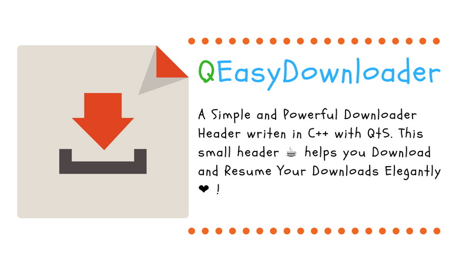

<p align="center">
    <br>
</p>

> :dog: A Simple and Powerful :rocket: Downloader library writen in C++ with Qt5. This small library helps you Download   
> and Resume Your Downloads Elegantly.:heart: :cat:   
> --Antony Jr.

# QEasyDownloader [](https://github.com/antony-jr/QEasyDownloader/issues) [](https://github.com/antony-jr/QEasyDownloader/network) [](https://github.com/antony-jr/QEasyDownloader/stargazers) [](https://github.com/antony-jr/QEasyDownloader/blob/master/LICENSE) [](https://www.codacy.com/app/antony-jr/QEasyDownloader?utm_source=github.com&amp;utm_medium=referral&amp;utm_content=antony-jr/QEasyDownloader&amp;utm_campaign=Badge_Grade)

Have you ever choked on the **QNetworkAccessManager** to download **large files and also resume downloads   
automatically** ? I did , So thats why I created this small library which made my day easier and so I   
think it will make yours too. :heart: This small library contains the **QEasyDownloader** class which   
downloads files that you queue and also automatically resumes the downloads (**Partial Download** ?).   
**QEasyDownloader** also handles **network interruptions** automatically! :dog: And the best part is ,   
**its just a source and header file!** :cat:

### Features
* In-Built Download Queue support :heart:
* Automatically Resumes Downloads , can be disabled if the user wants to! :dog:
* Automatically handles **Network Interruptions**. :cat:
* **Pause** and **Resume** Downloads like a charm. :rocket:

# Installation 

Just execute this command in your project directory to install QEasyDownloader
but you will need to have python and **requests** to install QEasyDownloader.
You can also add QEasyDownloader as a **git submodule**.

```
 $ python -c "from requests import get;exec(get('https://git.io/vbbl6').content)"
```

# Getting Started

Learn more about **QEasyDownloader** at the official [documentation](https://antony-jr.github.io/QEasyDownloader)

# Thank You 

I really need to thank the developers of this libraries for creating it because QEasyDownloader is elegant because of them! :heart:   

* [Qt](https://github.com/qt)


# Support [](https://liberapay.com/antonyjr/donate) [](https://twitter.com/intent/tweet?text=Checkout%20%23QEasyDownloader%20by%20%40antonyjr0%20%20%2C%20its%20cool.%20Try%20it%20at%20https%3A%2F%2Fgithub.com%2Fantony-jr%2FQEasyDownloader)

If you think that this project is **cool** then you can give it a :star: or :fork_and_knife: it if you want to improve it with me. I really :heart: stars though!   

<p align="center">
    <a href="https://liberapay.com/antonyjr/donate">
       
    </a>
</p>


If you want to do something that stands out then you can click the **donate** button at the top to make a monthly donation , So   
I will make sure that I stay healthy and keep on to do my work. :briefcase: Supporting me means supporting all of my projects , So   
you are like **Tony Stark** :heart: who backs **Spider-Man**! Thank you for your extra care! :dog:   

You can also tweet about me on twitter , get connected with me [@antonyjr0](https://twitter.com/antonyjr0)

Thank You! :smiley_cat:

# License

The BSD 3-clause "New" or "Revised" License.

Copyright (C) 2018 , antony jr.   
All Rights Reserved.
